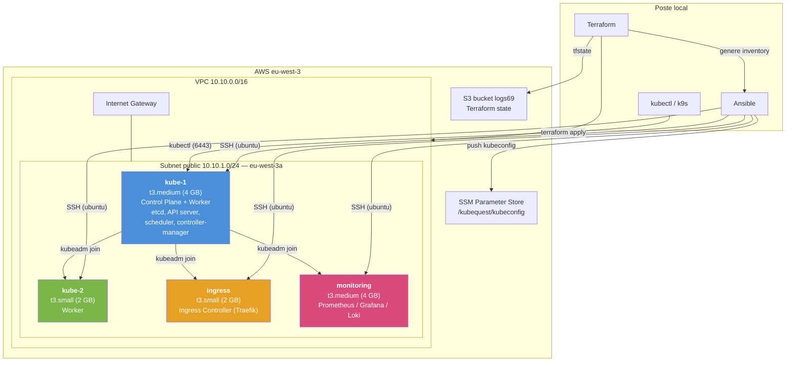
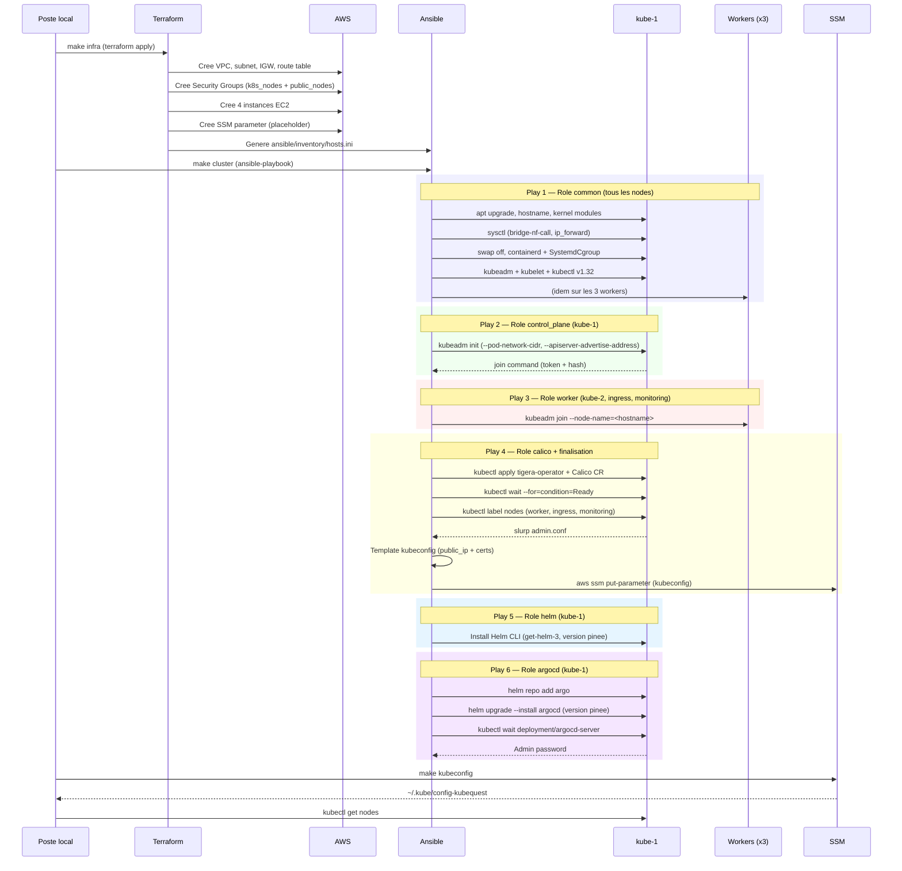

# KubeQuest

Cluster Kubernetes self-managed (kubeadm) sur AWS, provisionne from scratch avec Terraform + Ansible.

## Quick Start

```bash
# 1. Deployer l'infra AWS + provisionner le cluster (admin)
make all

# 2. Recuperer le kubeconfig depuis SSM (tout le monde)
make kubeconfig
export KUBECONFIG=~/.kube/config:~/.kube/config-kubequest
kubectl config use-context kubequest
kubectl get nodes
```

## Architecture



### Tableau des nodes

| Node | Role | Instance | RAM | Stockage | Security Group |
|---|---|---|---|---|---|
| kube-1 | Control plane + worker | t3.medium | 4 GB | 20 GB gp3 | k8s_nodes |
| kube-2 | Worker | t3.small | 2 GB | 20 GB gp3 | k8s_nodes |
| ingress | Ingress controller (Traefik) | t3.small | 2 GB | 20 GB gp3 | public_nodes |
| monitoring | Prometheus / Grafana / Loki | t3.medium | 4 GB | 30 GB gp3 | public_nodes |

**Cout estime : ~$97/mois**

### kubeadm vs EKS

| Composant | EKS (manage) | kubeadm (ici) |
|---|---|---|
| etcd | Gere par AWS, multi-AZ | Static pod sur kube-1, single node |
| API Server | Endpoint manage, HA | Static pod, on gere les certs |
| Scheduler / Controller Manager | Invisible, gere par AWS | Static pods qu'on peut inspecter |
| Kubelet | AMI optimisee, pre-configure | On installe et configure nous-memes |
| CNI | VPC CNI (integre aux ENI AWS) | Calico (overlay VXLAN) |
| Certificats | Geres automatiquement | kubeadm genere, rotation manuelle |
| Upgrades | `eksctl upgrade` | `kubeadm upgrade` noeud par noeud |
| Node groups | Managed/Fargate | On join manuellement chaque noeud |

---

## Arborescence du projet

```
KubeQuest/
  Makefile                  # Orchestration globale (make all / make kubeconfig / make destroy)
  terraform/                # Infrastructure AWS
    terraform.tf            # Version Terraform + providers + backend S3
    provider.tf             # Config du provider AWS (region, tags par defaut)
    data.tf                 # Data source pour l'AMI Ubuntu
    variables.tf            # Toutes les variables avec valeurs par defaut
    network.tf              # VPC, subnet, Internet Gateway, route table
    security.tf             # Key pair SSH, Security Groups (k8s_nodes + public_nodes)
    instances.tf            # 4 instances EC2
    ssm.tf                  # SSM Parameter Store pour le kubeconfig + IAM policy
    outputs.tf              # IPs, AMI, commandes SSH, generation de l'inventory Ansible
  ansible/
    ansible.cfg             # Config Ansible (inventory, user, SSH key)
    playbook.yml            # Playbook principal (6 plays)
    group_vars/
      all.yml               # Variables globales (versions Helm, ArgoCD, etc.)
    templates/
      kubeconfig.yml.j2     # Template Jinja2 pour le kubeconfig avec contexte "kubequest"
    roles/
      common/               # Setup OS sur tous les nodes
      control_plane/        # kubeadm init sur kube-1
      worker/               # kubeadm join sur les workers
      calico/               # Installation CNI Calico + labels + kubeconfig SSM
      helm/                 # Installation de Helm CLI (version pinee)
      argocd/               # Deploiement d'ArgoCD via Helm chart
```

---

## Flow de deploiement complet



---

## Terraform en detail

### `terraform.tf` — Backend et versions

```hcl
terraform {
  required_version = ">= 1.14.0"
  required_providers {
    aws = { source = "hashicorp/aws", version = "~> 6.0" }
  }
  backend "s3" {
    bucket = "logs69"
    key    = "kubequest/terraform.tfstate"
    region = "eu-west-3"
  }
}
```

- **`required_version >= 1.14.0`** : impose une version minimum de Terraform pour garantir la compatibilite des features utilisees.
- **`backend "s3"`** : le state Terraform est stocke dans S3 (`logs69/kubequest/terraform.tfstate`) au lieu d'un fichier local. Ca permet le travail collaboratif et evite de perdre le state si le poste local crame. Le bucket doit exister avant le `terraform init`.

### `provider.tf` — Provider AWS

```hcl
provider "aws" {
  region = var.aws_region
  default_tags {
    tags = {
      Project     = var.project_name
      ManagedBy   = "Terraform"
      Environment = "Jagermeister"
    }
  }
}
```

- **`region = var.aws_region`** : `eu-west-3` (Paris) par defaut. Toutes les resources sont creees dans cette region.
- **`default_tags`** : ces tags sont automatiquement appliques a **toutes** les resources crees par ce provider. Evite la repetition et permet de filtrer/trier dans la console AWS. `ManagedBy = "Terraform"` signale que la resource est geree par IaC (ne pas toucher a la main).

### `data.tf` — AMI Ubuntu

```hcl
data "aws_ami" "ubuntu" {
  most_recent = true
  owners      = ["099720109477"]  # Canonical
  filter { name = "name"; values = ["ubuntu/images/hvm-ssd/ubuntu-jammy-22.04-amd64-server-*"] }
  filter { name = "virtualization-type"; values = ["hvm"] }
  filter { name = "architecture"; values = ["x86_64"] }
}
```

- **Data source** (pas une resource) : interroge l'API AWS pour trouver la derniere AMI Ubuntu 22.04 LTS publiee par Canonical. Pas besoin de hardcoder un AMI ID qui change a chaque patch.
- **`owners = ["099720109477"]`** : l'account ID officiel de Canonical. Securite : on ne prend que les AMI publiees par l'editeur officiel.
- **`most_recent = true`** : prend la plus recente qui matche les filtres (derniers patches de securite).
- **`hvm`** : Hardware Virtual Machine, le type de virtualisation standard sur AWS (vs `paravirtual` qui est legacy).

### `network.tf` — VPC, Subnet, Internet Gateway

**VPC** (`10.10.0.0/16` = 65 536 IPs) :
- **`enable_dns_support`** : les instances peuvent resoudre les DNS internes AWS (ex: `ip-10-10-1-5.eu-west-3.compute.internal`).
- **`enable_dns_hostnames`** : les instances avec IP publique recoivent un hostname DNS public (requis pour que les nodes se resolvent entre eux).
- **Tag `kubernetes.io/cluster/kubequest = "owned"`** : convention Kubernetes. Indique que ce VPC appartient au cluster. Necessaire si on utilise un Cloud Controller Manager ou un ingress qui cree des ELB.

**Subnet public** (`10.10.1.0/24` = 254 IPs) :
- **`map_public_ip_on_launch = true`** : chaque instance lancee dans ce subnet recoit automatiquement une IP publique. On fait ca car on n'a pas de NAT Gateway (trop cher).
- **`availability_zone = eu-west-3a`** : une seule AZ (pas de HA multi-AZ, c'est un cluster de dev/learning).
- **Tag `kubernetes.io/role/elb = "1"`** : dit a Kubernetes "ce subnet est eligible pour les Load Balancers publics".

**Internet Gateway + Route Table** :
- L'IGW est le "routeur" entre le VPC et Internet.
- La route `0.0.0.0/0 -> IGW` envoie tout le trafic sortant vers Internet. Sans ca, les instances n'ont pas d'acces Internet meme avec une IP publique.

### `security.tf` — Security Groups

**Pourquoi 2 SGs separes ?**
- `k8s_nodes` (kube-1, kube-2) : nodes internes, pas d'acces HTTP/HTTPS depuis Internet.
- `public_nodes` (ingress, monitoring) : exposent des services (HTTP/HTTPS/Grafana/Prometheus).

**SG `k8s_nodes`** — Regles d'entree :

| Port | Proto | Source | Pourquoi |
|---|---|---|---|
| 22 | TCP | `my_ip_cidr` | SSH admin uniquement (pas ouvert au monde) |
| 6443 | TCP | VPC + `my_ip_cidr` | API server Kubernetes. Le VPC en a besoin pour kubelet/kube-proxy. L'admin en a besoin pour kubectl/k9s depuis son poste |
| 2379-2380 | TCP | self | etcd : communication client (2379) et peer (2380). `self` = uniquement les membres du meme SG |
| 10250 | TCP | self | kubelet API : utilise par l'API server pour `kubectl exec`, `kubectl logs`, metrics |
| 30000-32767 | TCP | 0.0.0.0/0 | NodePort range : services Kubernetes exposes via NodePort |
| 8472 | UDP | self | VXLAN : trafic overlay Calico entre les nodes (encapsule les paquets pod-to-pod) |
| all | all | VPC CIDR | Catch-all intra-VPC pour la communication cross-SG (k8s_nodes <-> public_nodes) |
| all | all | Pod CIDR | Les pods ont des IPs dans `192.168.0.0/16`, il faut que ce trafic soit autorise |

**SG `public_nodes`** — Differences par rapport a `k8s_nodes` :

| Port | Proto | Source | Pourquoi |
|---|---|---|---|
| 80 | TCP | 0.0.0.0/0 | HTTP : trafic web vers l'ingress controller |
| 443 | TCP | 0.0.0.0/0 | HTTPS : trafic web TLS |
| 3000 | TCP | `my_ip_cidr` | Grafana : dashboard de monitoring, restreint a l'admin |
| 9090 | TCP | `my_ip_cidr` | Prometheus : metriques, restreint a l'admin |

**Egress** : `0.0.0.0/0` en sortie sur les deux SGs (les nodes doivent telecharger des packages, des images Docker, etc.).

### `instances.tf` — Les 4 EC2

Chaque instance partage ces parametres :
- **`ami = data.aws_ami.ubuntu.id`** : l'AMI Ubuntu trouvee dynamiquement.
- **`key_name`** : la cle SSH uploadee (`~/.ssh/id_ed25519.pub` par defaut).
- **`credit_specification { cpu_credits = "standard" }`** : les instances T3 fonctionnent en mode "burstable". `standard` = quand les credits CPU sont epuises, la perf est bridee (pas de surcharge de facturation contrairement a `unlimited`).
- **`metadata_options { http_tokens = "required" }`** : force IMDSv2 (Instance Metadata Service v2). Securite : empeche les attaques SSRF de voler les credentials du role IAM via le metadata endpoint.
- **`root_block_device`** : disque `gp3` (SSD general purpose, derniere generation). 20 GB pour tous sauf monitoring (30 GB pour stocker les metriques Prometheus).

Differences par instance :
- **kube-1** : `t3.medium` (4 GB RAM) car le control plane (etcd + API server + scheduler + controller-manager) consomme ~1.5 GB minimum. Aussi worker car avec 4 nodes on ne peut pas se permettre de "gaspiller" le CP.
- **kube-2** : `t3.small` (2 GB) suffisant pour un worker simple.
- **ingress** : `t3.small` (2 GB) dans le SG `public_nodes` car il recoit le trafic HTTP/HTTPS du monde.
- **monitoring** : `t3.medium` (4 GB) car Prometheus est gourmand en RAM (stocke les series temporelles en memoire) + 30 GB de disque.

### `ssm.tf` — SSM Parameter Store

```hcl
resource "aws_ssm_parameter" "kubeconfig" {
  type  = "SecureString"
  tier  = "Advanced"
  value = "placeholder"
  lifecycle { ignore_changes = [value] }
}
```

- **`SecureString`** : le kubeconfig contient des certificats clients = acces admin au cluster. Stocke chiffre avec KMS.
- **`tier = "Advanced"`** : le kubeconfig depasse 4 KB (limite du tier Standard) a cause des certificats base64.
- **`value = "placeholder"`** : Terraform cree le parametre vide. C'est Ansible qui le remplira apres `kubeadm init`.
- **`ignore_changes = [value]`** : critique ! Sans ca, chaque `terraform apply` reecrirait le kubeconfig avec "placeholder" et casserait l'acces au cluster.

**IAM Policy `kubeconfig_read`** : politique read-only qu'on peut attacher aux devs pour qu'ils puissent `make kubeconfig` sans avoir acces a l'infra.

### `outputs.tf` — Outputs + Inventory Ansible

Les outputs exportent les IPs publiques/privees et les commandes SSH.

**Generation automatique de l'inventory Ansible** (`local_file`) :
```ini
[control_plane]
kube-1 ansible_host=<public_ip> private_ip=<private_ip> public_ip=<public_ip>

[workers]
kube-2     ansible_host=...
ingress    ansible_host=...
monitoring ansible_host=...

[k8s_cluster:children]
control_plane
workers
```

- **`ansible_host`** : IP publique pour que Ansible se connecte en SSH depuis le poste local.
- **`private_ip`** : utilisee par `kubeadm init --apiserver-advertise-address` (le control plane ecoute sur l'IP privee du VPC).
- **`public_ip`** : utilisee pour `--apiserver-cert-extra-sans` et le kubeconfig (on accede au cluster depuis l'exterieur via l'IP publique).
- **`[k8s_cluster:children]`** : groupe parent Ansible qui inclut control_plane + workers. Le role `common` s'execute sur ce groupe.

---

## Ansible en detail

### `ansible.cfg`

```ini
remote_user = ubuntu          # user par defaut des AMI Ubuntu
private_key_file = ~/.ssh/id_ed25519
host_key_checking = false     # skip la verification SSH (les IPs changent a chaque apply)
```

### Play 1 : Role `common` (tous les nodes)

S'execute sur le groupe `k8s_cluster` (les 4 machines).

**1. apt upgrade** : met a jour l'OS. Les AMI AWS ne sont pas toujours a jour.

**2. Hostname** : `inventory_hostname` (kube-1, kube-2, ingress, monitoring). Important car kubeadm utilise le hostname comme nom de node dans le cluster.

**3. Kernel modules** :
- **`overlay`** : module de filesystem overlay. containerd en a besoin pour superposer les couches d'images Docker (chaque layer d'une image est un filesystem overlay).
- **`br_netfilter`** : fait passer le trafic des bridges Linux par les regles iptables/netfilter. Sans ca, kube-proxy ne peut pas intercepter le trafic des Services (ClusterIP, NodePort).
- Les modules sont charges immediatement (`modprobe`) ET persistes dans `/etc/modules-load.d/k8s.conf` pour survivre aux reboots.

**4. Sysctl** :
- **`net.bridge.bridge-nf-call-iptables = 1`** : active le filtrage iptables sur les bridges (necessite `br_netfilter`). kube-proxy cree des regles iptables pour router le trafic vers les bons pods derriere un Service.
- **`net.bridge.bridge-nf-call-ip6tables = 1`** : idem pour IPv6.
- **`net.ipv4.ip_forward = 1`** : transforme le node en routeur. Un pod sur kube-1 doit pouvoir communiquer avec un pod sur kube-2 : le noeud doit forwarder les paquets entre ses interfaces.

**5. Swap off** :
- `swapoff -a` : desactive immediatement.
- Supprime l'entree swap de `/etc/fstab` : ne reviendra pas au reboot.
- Pourquoi : kubelet refuse de demarrer avec swap active. Kubernetes gere la memoire via les requests/limits des pods. Le swap fausserait les garanties de QoS (un pod qui depasse sa limit memoire doit etre OOMKilled, pas swapped).

**6. containerd** :
- Installe containerd (le CRI = Container Runtime Interface).
- Genere la config par defaut (`containerd config default`).
- **`SystemdCgroup = true`** : aligne le driver de cgroups de containerd sur systemd. Par defaut, containerd utilise `cgroupfs`. Mais kubelet utilise `systemd`. Si les deux ne sont pas alignes, on a des conflits : les containers peuvent etre tues aleatoirement car les deux gestionnaires se battent pour les memes cgroups.

**7. Kubernetes packages** :
- Ajoute le repo officiel Kubernetes (`pkgs.k8s.io/core:/stable:/v1.32`) avec sa cle GPG.
- Installe `kubeadm`, `kubelet`, `kubectl` en version 1.32.
- **`dpkg_selections: hold`** : empeche `apt upgrade` de mettre a jour ces packages accidentellement. Les upgrades Kubernetes doivent etre controlees (kubeadm upgrade).

### Play 2 : Role `control_plane` (kube-1 uniquement)

```bash
kubeadm init \
  --apiserver-advertise-address={{ private_ip }} \
  --pod-network-cidr=192.168.0.0/16 \
  --node-name={{ inventory_hostname }} \
  --apiserver-cert-extra-sans={{ public_ip }}
```

- **`--apiserver-advertise-address`** : l'IP privee sur laquelle l'API server ecoute. Utilise l'IP privee car les autres nodes communiquent via le VPC (pas via Internet).
- **`--pod-network-cidr=192.168.0.0/16`** : le CIDR reserve aux pods. Calico utilise ce range par defaut. Chaque node recoit un sous-bloc `/26` (64 IPs) de ce range.
- **`--node-name`** : force le nom du node (sinon c'est le hostname EC2 `ip-10-10-1-xxx` qui serait utilise).
- **`--apiserver-cert-extra-sans`** : ajoute l'IP publique comme SAN (Subject Alternative Name) dans le certificat TLS de l'API server. Sans ca, `kubectl` depuis le poste local verrait une erreur de certificat (le cert ne couvrirait que l'IP privee).

**Idempotence** : verifie si `/etc/kubernetes/admin.conf` existe deja avant d'init. Evite de planter si on relance le playbook.

Apres l'init :
- Copie `admin.conf` vers `~ubuntu/.kube/config` pour que l'user `ubuntu` puisse utiliser `kubectl`.
- `kubeadm token create --print-join-command` : genere la commande de join et la stocke en Ansible fact pour le play suivant.

### Play 3 : Role `worker` (kube-2, ingress, monitoring)

```bash
{{ hostvars[groups['control_plane'][0]].kubeadm_join_command }} --node-name={{ inventory_hostname }}
```

- Recupere la join command depuis les facts du control plane (stockee au play 2).
- **`--node-name`** : force le hostname (meme raison que l'init).
- **Idempotence** : verifie si `/etc/kubernetes/kubelet.conf` existe avant de join.

Processus interne du join :
1. Le worker contacte l'API server avec le bootstrap token.
2. TLS Bootstrap : le kubelet genere un CSR, l'API server l'approuve automatiquement.
3. Le node est enregistre dans l'API, le scheduler peut y placer des pods.

### Play 4 : Role `calico` + Finalisation (kube-1)

**Calico CNI** :
1. Applique le manifest Tigera Operator (gestionnaire de Calico).
2. Cree la custom resource `Installation` :
   - **`blockSize: 26`** : chaque node recoit un `/26` (64 IPs pour les pods). Suffisant pour un petit cluster.
   - **`cidr: 192.168.0.0/16`** : doit matcher le `--pod-network-cidr` du kubeadm init.
   - **`encapsulation: VXLANCrossSubnet`** : encapsule le trafic pod-to-pod en VXLAN uniquement quand les pods sont sur des subnets differents. Si les pods sont sur le meme node, trafic direct sans encapsulation (plus performant).
   - **`natOutgoing: Enabled`** : les pods peuvent acceder a Internet (le trafic sortant est NATe avec l'IP du node).
3. `kubectl wait --for=condition=Ready` : attend que tous les nodes soient Ready (Calico doit d'abord etre operationnel).

**Labels des nodes** :
- `kube-2` : `node-role.kubernetes.io/worker` (affichage dans `kubectl get nodes`).
- `ingress` : `node-role.kubernetes.io/ingress` (permet des `nodeSelector` pour placer Traefik sur ce node).
- `monitoring` : `node-role.kubernetes.io/monitoring` (permet des `nodeSelector` pour Prometheus/Grafana/Loki).

### Play 5 : Role `helm` (kube-1)

Installe Helm CLI sur le control plane. La version est pinee dans `group_vars/all.yml`.

- Verifie si Helm est deja installe (`helm version --short`).
- Si non : telecharge le script officiel `get-helm-3` et l'execute avec `DESIRED_VERSION={{ helm_version }}`.
- Nettoie le script apres installation.

### Play 6 : Role `argocd` (kube-1)

Deploie ArgoCD via Helm chart. La version du chart est pinee dans `group_vars/all.yml`.

1. Ajoute le repo Helm `argo` (`https://argoproj.github.io/argo-helm`).
2. `helm repo update` pour recuperer les derniers index.
3. Cree le namespace `argocd`.
4. `helm upgrade --install argocd argo/argo-cd --version {{ argocd_chart_version }}` avec un fichier `values.yaml`.
5. Attend que le deployment `argocd-server` soit disponible.
6. Recupere et affiche le mot de passe admin initial.

**Configuration (values.yaml)** :
- **`global.tolerations`** + **`global.nodeSelector`** : tous les composants ArgoCD tournent sur le control plane (kube-1). La toleration autorise le scheduling malgre le taint `NoSchedule`, le nodeSelector force le placement.
- **Service ClusterIP** (par defaut) : acces via `kubectl port-forward svc/argocd-server -n argocd 8080:443`.
- **Resource requests/limits** : dimensionnes pour un petit cluster.

**Gestion des versions** :

Les versions sont centralisees dans `ansible/group_vars/all.yml` :
```yaml
helm_version: "v4.1.3"
argocd_chart_version: "9.4.10"
```

Pour monter de version : modifier ce fichier et relancer `make cluster`.

**Kubeconfig SSM** :
1. `slurp` lit `/etc/kubernetes/admin.conf` depuis kube-1 (base64).
2. Le template Jinja2 (`kubeconfig.yml.j2`) reconstruit un kubeconfig propre :
   - Remplace l'IP privee par l'IP **publique** dans `server: https://{{ public_ip }}:6443`
   - Cree un contexte nomme `kubequest` (plus clair que `kubernetes-admin@kubernetes`)
   - Conserve les certificats (CA cert, client cert, client key)
3. Push vers SSM Parameter Store (SecureString, chiffre KMS).
4. Supprime le fichier temporaire `/tmp/kubeconfig-kubequest`.

---

## Makefile

| Commande | Action |
|---|---|
| `make all` | `make infra` + `make cluster` |
| `make infra` | `terraform apply` (cree l'infra + genere l'inventory Ansible) |
| `make cluster` | `ansible-playbook playbook.yml` (provisionne le cluster) |
| `make kubeconfig` | Fetch le kubeconfig depuis SSM vers `~/.kube/config-kubequest` |
| `make argocd-password` | Affiche le mot de passe admin initial d'ArgoCD |
| `make destroy` | `terraform destroy` (supprime toute l'infra) |

---

## Prerequis

- Terraform >= 1.14
- Ansible + collections `community.general`, `ansible.posix`
- AWS CLI configure avec un profil ayant les droits EC2/VPC/SSM/S3/IAM
- Cle SSH `~/.ssh/id_ed25519` (ou modifier `ssh_public_key_path` dans les variables)
- Bucket S3 `logs69` existant (pour le tfstate)

## Commandes utiles

```bash
# Cluster
kubectl get nodes -o wide
kubectl get pods -A
kubectl cluster-info

# Debug
kubectl describe node <name>
kubectl logs -n kube-system <pod>
journalctl -u kubelet -f            # sur le node, logs kubelet temps reel
crictl ps                            # containers geres par containerd
crictl logs <container-id>

# ArgoCD
kubectl get pods -n argocd
make argocd-password
kubectl port-forward svc/argocd-server -n argocd 8080:443  # UI sur https://localhost:8080

# Certificats
kubeadm certs check-expiration
openssl x509 -in /etc/kubernetes/pki/apiserver.crt -noout -dates

# Tokens
kubeadm token list
kubeadm token create --print-join-command

# Static pods
ls /etc/kubernetes/manifests/
```
