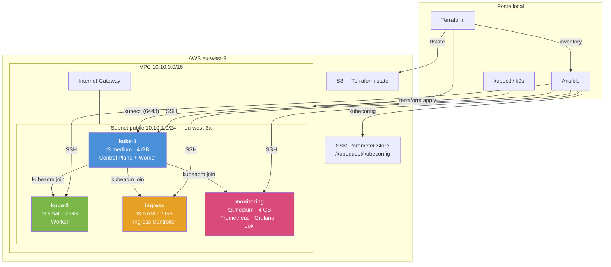

# KubeQuest

Cluster Kubernetes self-managed (kubeadm) sur AWS, provisionné from scratch avec Terraform + Ansible. GitOps via ArgoCD (App of Apps).

## Architecture


```mermaid
flowchart TB
    subgraph DEV["Poste local"]
        TF["Terraform"]
        AN["Ansible"]
        KC["kubectl / k9s"]
    end

    subgraph AWS["AWS eu-west-3"]
        subgraph VPC["VPC 10.10.0.0/16"]
            subgraph SUBNET["Subnet public 10.10.1.0/24 — eu-west-3a"]
                K1["<b>kube-1</b><br/>t3.medium · 4 GB<br/>Control Plane + Worker"]
                K2["<b>kube-2</b><br/>t3.small · 2 GB<br/>Worker"]
                IG["<b>ingress</b><br/>t3.small · 2 GB<br/>Ingress Controller"]
                MO["<b>monitoring</b><br/>t3.medium · 4 GB<br/>Prometheus · Grafana · Loki"]
            end
            IGW["Internet Gateway"]
        end
        SSM["SSM Parameter Store<br/>/kubequest/kubeconfig"]
        S3["S3 — Terraform state"]
    end

    TF -- "terraform apply" --> VPC
    TF -- "tfstate" --> S3
    TF -- "inventory" --> AN
    AN -- "SSH" --> K1
    AN -- "SSH" --> K2
    AN -- "SSH" --> IG
    AN -- "SSH" --> MO
    AN -- "kubeconfig" --> SSM
    KC -- "kubectl (6443)" --> K1

    K1 -- "kubeadm join" --> K2
    K1 -- "kubeadm join" --> IG
    K1 -- "kubeadm join" --> MO

    IGW --- SUBNET

    style K1 fill:#4a90d9,color:#fff
    style K2 fill:#7ab648,color:#fff
    style IG fill:#e6a023,color:#fff
    style MO fill:#d94a7a,color:#fff
```

| Node | Role | Instance | RAM | Disque | SG |
|---|---|---|---|---|---|
| kube-1 | Control plane + worker | t3.medium | 4 GB | 20 GB | k8s_nodes |
| kube-2 | Worker | t3.small | 2 GB | 20 GB | k8s_nodes |
| ingress | Ingress controller (Nginx) | t3.small | 2 GB | 20 GB | public_nodes |
| monitoring | Prometheus / Grafana / Loki | t3.medium | 4 GB | 30 GB | public_nodes |

**Cout estime : ~$97/mois**

## Stack applicative

Deploye automatiquement par ArgoCD via le dossier `apps/` (App of Apps pattern).

| App | Chart Helm | Namespace | Role |
|---|---|---|---|
| ingress-nginx | `ingress-nginx` 4.15.0 | ingress-nginx | Reverse proxy, hostNetwork sur node ingress |
| podinfo | `podinfo` 6.11.1 | podinfo | App de demo |
| local-path-provisioner | `local-path-provisioner` 0.0.32 | local-path-storage | StorageClass pour PVC (hostPath) |
| metrics-server | `metrics-server` 3.13.0 | kube-system | `kubectl top`, HPA |
| kube-prometheus-stack | `kube-prometheus-stack` 82.10.5 | monitoring | Prometheus, Grafana, Alertmanager, node-exporter, kube-state-metrics |
| loki | `loki` 6.55.0 | monitoring | Agregation de logs (SingleBinary) |
| alloy | `alloy` 1.6.2 | monitoring | Collecte de logs (DaemonSet, successeur de Promtail) |

**Acces web** (via ingress-nginx) :

| Path | Service |
|---|---|
| `/` | podinfo |
| `/grafana` | Grafana (admin/admin) |
| `/prometheus` | Prometheus UI |

## Quick Start

```bash
# Deployer l'infra + provisionner le cluster
make all

# Recuperer le kubeconfig
make kubeconfig
export KUBECONFIG=~/.kube/config:~/.kube/config-kubequest
kubectl config use-context kubequest
```

## Makefile

| Commande | Action |
|---|---|
| `make all` | Infra + cluster |
| `make infra` | `terraform apply` |
| `make cluster` | `ansible-playbook` |
| `make kubeconfig` | Fetch kubeconfig depuis SSM |
| `make argocd-password` | Mot de passe admin ArgoCD |
| `make destroy` | `terraform destroy` |

## Arborescence

```
KubeQuest/
  Makefile
  apps/                          # ArgoCD Applications (App of Apps)
  terraform/                     # Infra AWS (VPC, EC2, SG, SSM)
  ansible/
    playbook.yml                 # 6 plays : common → control_plane → worker → calico → helm → argocd
    roles/
      common/                    # OS setup, containerd, kubeadm/kubelet/kubectl
      control_plane/             # kubeadm init
      worker/                    # kubeadm join
      calico/                    # CNI Calico VXLAN + labels/taints + kubeconfig SSM
      helm/                      # Helm CLI
      argocd/                    # ArgoCD + bootstrap App of Apps
```

## Choix techniques

- **CNI Calico VXLAN** : encapsulation obligatoire sur AWS (source/dest check sur les ENI)
- **kubeadm** (vs EKS) : approche educative, controle total sur le control plane
- **ArgoCD App of Apps** : tout deploiement = un fichier YAML dans `apps/`, sync automatique
- **Monitoring sur node dedie** : taint `NoSchedule` pour isoler les workloads monitoring (budget RAM 4 GB)
- **Ingress path-based** : un seul point d'entree (port 80 du node ingress) pour toutes les apps

## CI/CD

**GitHub Actions** : 4 jobs paralleles sur chaque push/PR — yamllint, terraform fmt+validate, ansible-lint, kubeconform.

**Pre-commit** : memes checks en local avant chaque commit.

## Prerequis

- Terraform >= 1.14
- Ansible
- AWS CLI configure (EC2, VPC, SSM, S3, IAM)
- Cle SSH `~/.ssh/id_ed25519`
- Bucket S3 `logs69` existant
