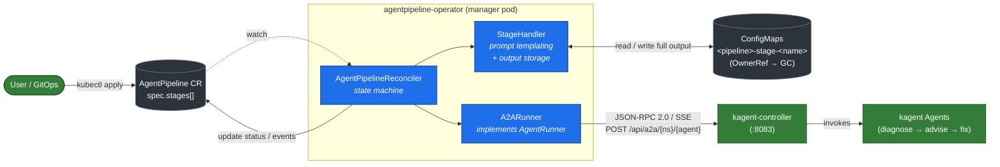
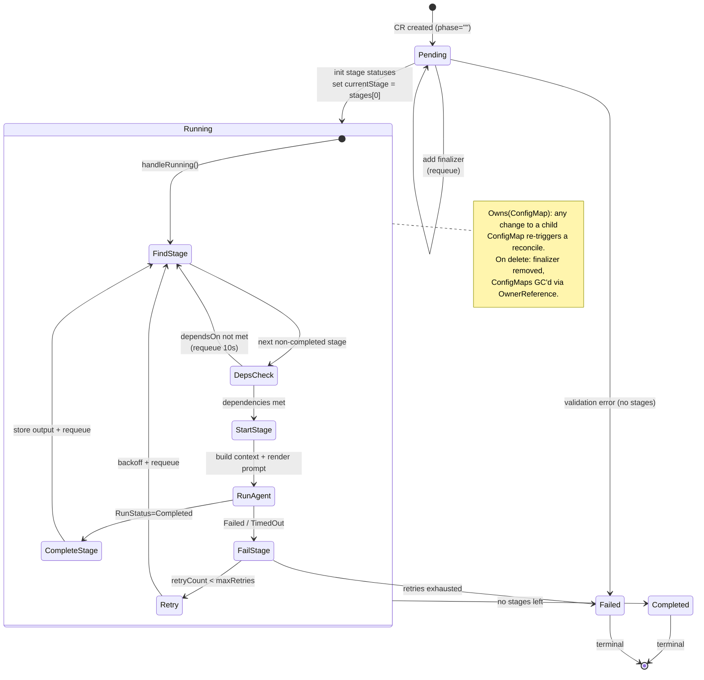
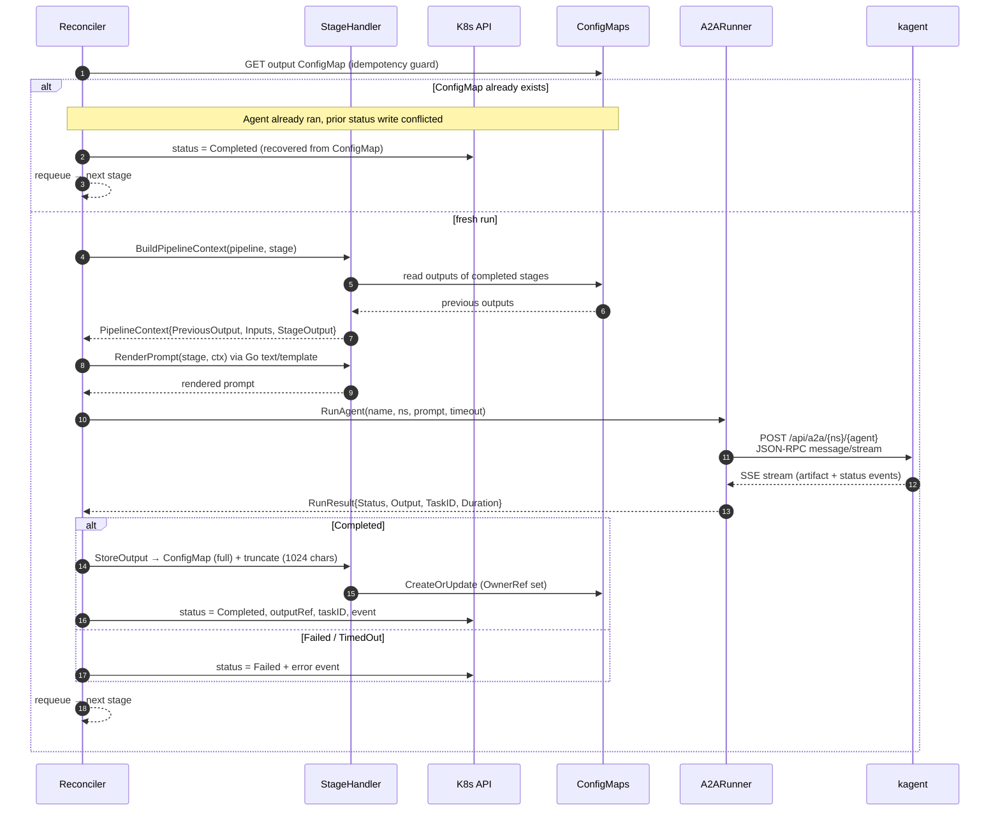

# agentpipeline-operator

Kubernetes operator that orchestrates AI agent pipelines (kagent) for cluster diagnostics and GitOps automation.

## Description

Watches `AgentPipeline` CRDs and executes ordered stages of kagent agents (diagnose → advise → propose-fix)
via the A2A (Agent-to-Agent) HTTP/SSE protocol.

### A2A Protocol Details

The operator communicates with kagent using JSON-RPC 2.0 over the A2A protocol:

- **Method**: `message/stream` (SSE streaming). `message/send` returns plain JSON and is not used.
- **Part format**: Each message part must include a `"kind"` field (e.g. `"kind": "text"`), as required by `a2a-go` v0.3.x used by kagent.
- **Output sources**: Agent responses can arrive as:
  - `task_artifact_update` events (preferred — the agent's final answer)
  - `status.message` in `task_status_update` events (fallback)
  - The `completed` status event itself often carries no message — output must be collected from earlier events.

### Idempotency

The controller guards against duplicate agent invocations caused by Kubernetes ResourceVersion conflicts.
Before starting a stage, it checks if the output ConfigMap already exists. If it does, the agent already
ran successfully but the status update failed — the controller recovers from the existing output without
re-invoking the agent.

## Architecture & Flow

### High-level components



The reconciler is wired in `cmd/main.go` with manual dependency injection: the
`A2ARunner` and `StageHandler` are constructed and passed into the reconciler,
which makes the runner mockable for unit tests (`internal/runner/mock_runner.go`).

### Reconcile state machine

The controller is driven entirely by `status.phase`. Each reconcile pass advances
the pipeline by **at most one stage**, then requeues itself.



### Single stage execution (sequence)

What happens inside `startStage` when a stage runs — including the idempotency
guard that prevents duplicate agent invocations after a status-write conflict.



> **Why ConfigMaps for stage output?** A CR's `status` is capped by etcd's per-object
> size limit and isn't meant for large blobs. The full agent response lives in a
> ConfigMap (`<pipeline>-stage-<name>`); `status.stages[].output` keeps only the last
> 1024 characters plus an `outputRef` pointer to the ConfigMap.

> **Note:** Agent invocation is **synchronous** inside the reconcile loop — a stage with
> a 5-minute timeout occupies a controller worker for that duration. This keeps the design
> simple at the cost of cross-pipeline parallelism.

## Getting Started

### Prerequisites
- go version v1.24.6+
- podman (or docker) — see [Container Runtime](#container-runtime) below
- kubectl version v1.11.3+
- Access to a Kubernetes v1.11.3+ cluster

### Container Runtime

This project uses **podman** by default (`CONTAINER_TOOL=podman` in the Makefile).
You can override it with `make docker-build CONTAINER_TOOL=docker` if you use Docker.

**Podman vs Docker — `.dockerignore` caveat:**
Podman/Buildah does not handle "deny-all + re-include" patterns (e.g. `**` then `!**/*.go`)
the same way Docker BuildKit does. The `.dockerignore` in this project uses an explicit
exclude list instead, which works reliably with both podman and docker.

**Cross-compilation (ARM Mac → amd64 cluster):**
The Go binary is cross-compiled on the host via `GOOS=linux GOARCH=amd64` before the
image build. The Dockerfile only copies the pre-built binary into a distroless image —
no `RUN` instructions, no QEMU emulation, no segfaults on ARM Macs.

### To Deploy on the cluster

**1. Login to the container registry:**

Requires a [Personal Access Token (classic)](https://github.com/settings/tokens/new) with the `write:packages` scope:
```sh
podman login ghcr.io -u <github-username>
# Enter your PAT when prompted for password
```

**2. Build, push, and deploy:**

```sh
# Build (cross-compiles Go binary + builds container image), push, and deploy (bump that bitch)
export IMG=ghcr.io/glutenfree69/agentpipeline-operator:v0.1.0
make docker-build $IMG
make docker-push $IMG
make deploy $IMG
```

> **IMPORTANT: Bump that bitch** (e.g. `v0.1.0` → `v0.1.1`) every time you rebuild.
> Kubernetes caches images by tag on each node. If you push a new image with the same tag,
> the cluster will keep using the old cached version. Bump the tag or you'll go crazy
> debugging why your changes don't show up.

**3. Apply a sample pipeline:**

```sh
kubectl apply -f config/samples/aiops_v1alpha1_agentpipeline.yaml
kubectl -n kagent get agentpipelines
kubectl -n kagent describe agentpipeline incident-response
```

> **NOTE**: If you encounter RBAC errors, you may need to grant yourself cluster-admin
> privileges or be logged in as admin.

### Configuration

The Makefile auto-configures kubeconfig and context for cluster69. Override via:

| Variable | Default | Description |
|---|---|---|
| `IMG` | `controller:latest` | Container image URL |
| `CONTAINER_TOOL` | `podman` | Container runtime (`podman` or `docker`) |
| `TARGETARCH` | `amd64` | Target architecture for cross-compilation |
| `KUBECTL_CONTEXT` | `cluster69` | Kubernetes context |

Run `make help` for all available targets.

### To Uninstall
**Delete the instances (CRs) from the cluster:**

```sh
kubectl delete -k config/samples/
```

**Delete the APIs(CRDs) from the cluster:**

```sh
make uninstall
```

**UnDeploy the controller from the cluster:**

```sh
make undeploy
```

## Contributing

**NOTE:** Run `make help` for more information on all potential `make` targets

More information can be found via the [Kubebuilder Documentation](https://book.kubebuilder.io/introduction.html)

## License

Copyright 2026.

Licensed under the Apache License, Version 2.0 (the "License");
you may not use this file except in compliance with the License.
You may obtain a copy of the License at

    http://www.apache.org/licenses/LICENSE-2.0

Unless required by applicable law or agreed to in writing, software
distributed under the License is distributed on an "AS IS" BASIS,
WITHOUT WARRANTIES OR CONDITIONS OF ANY KIND, either express or implied.
See the License for the specific language governing permissions and
limitations under the License.
